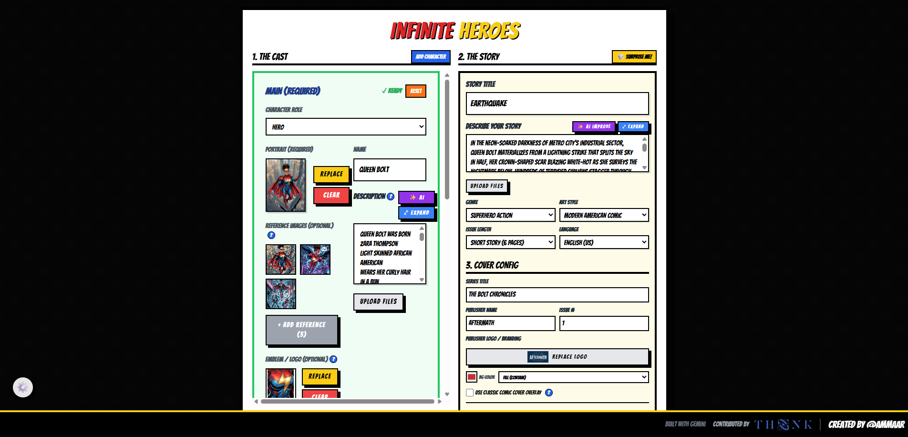
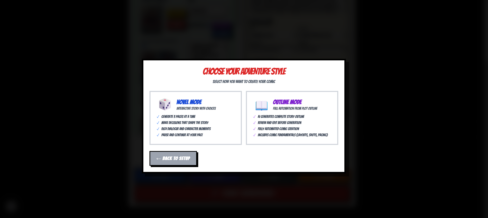
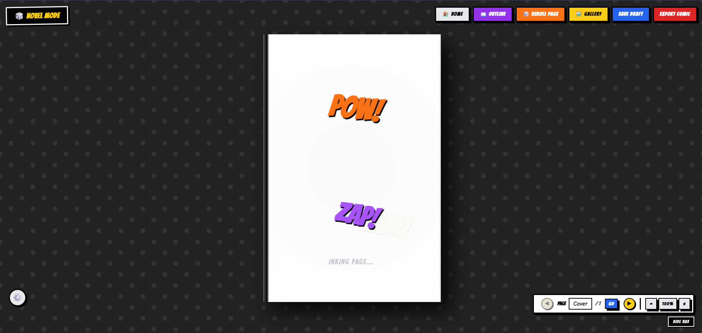
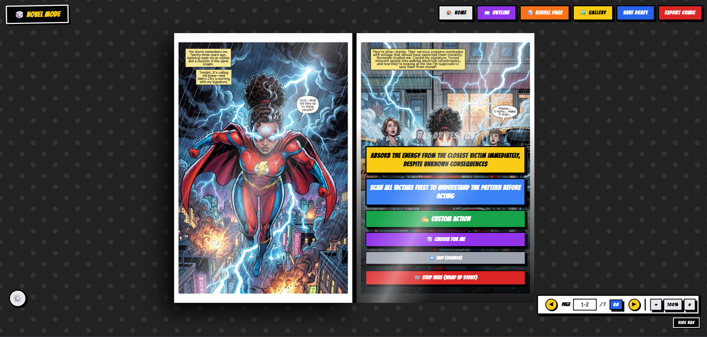
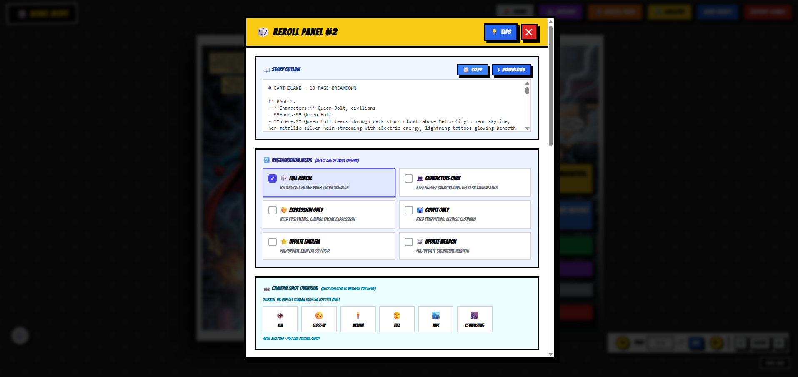
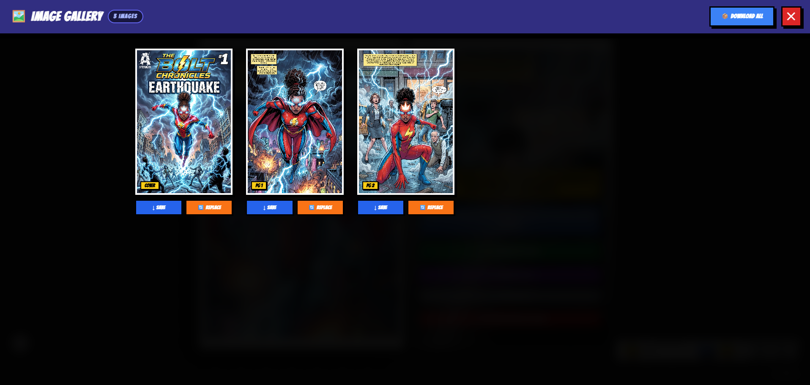
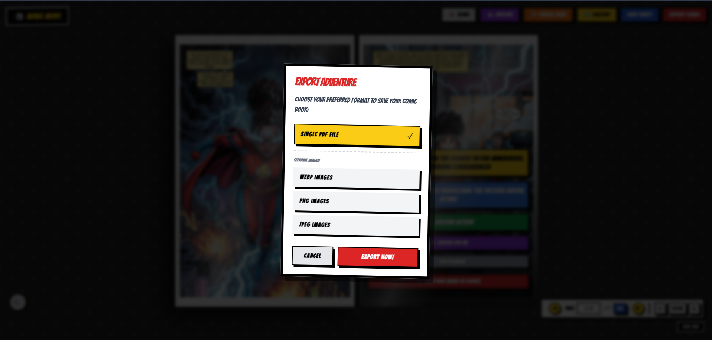
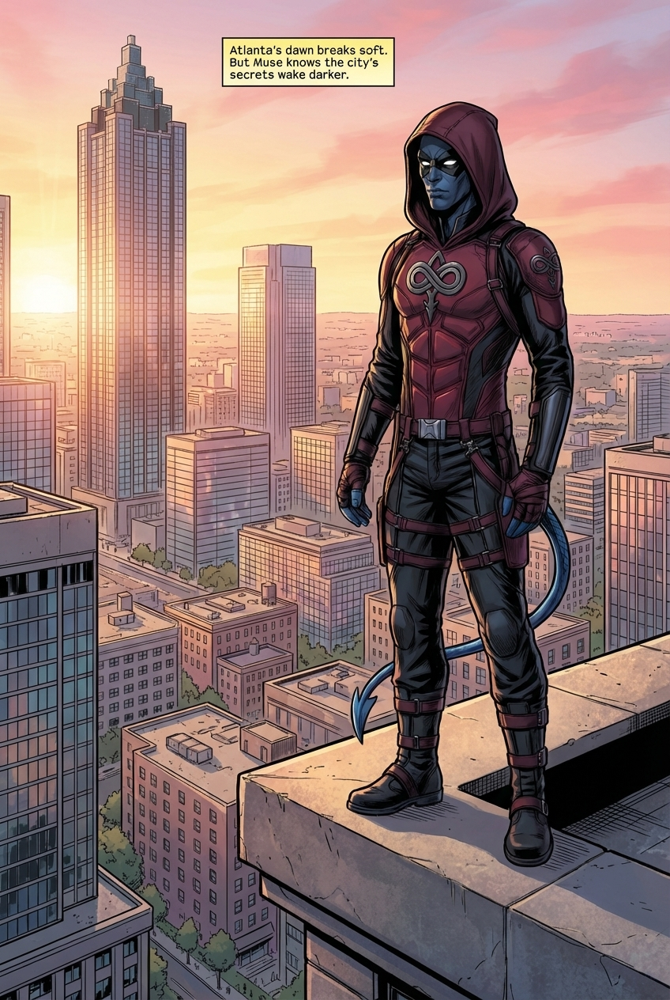
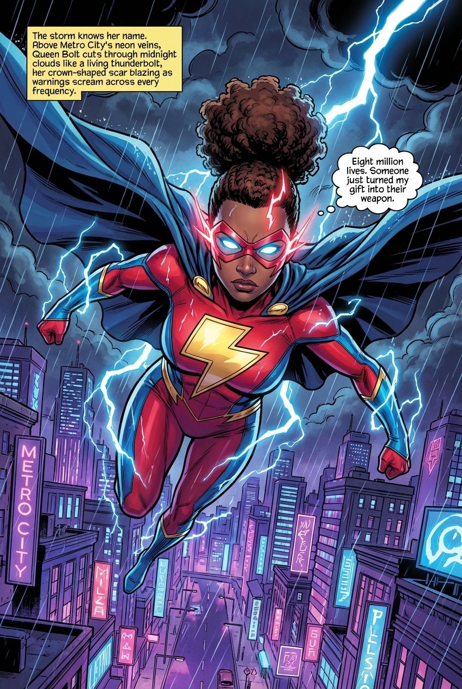
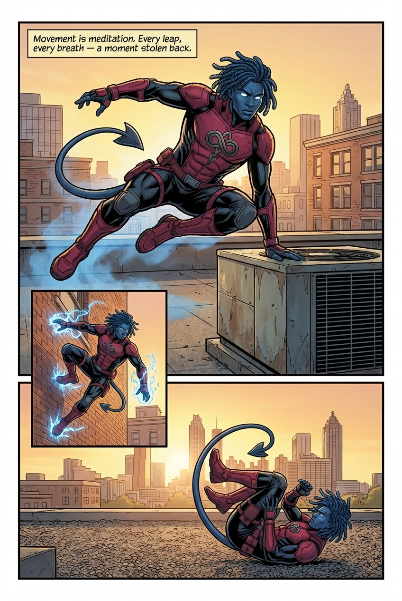

# Infinite Heroes: AI-Powered Comic Creator 🦸‍♂️💥📖

> **Transform your imagination into stunning comic book adventures!**

[](https://infinite-heroes-comic-creator.vercel.app/)
[](https://ai.google.dev/)

**Infinite Heroes** is your personal AI comic studio! Using Google's cutting-edge Gemini AI, create complete comic books with consistent characters, dynamic storytelling, and professional-quality art—all from your browser.

🎮 **[Try the Live Demo](https://infinite-heroes-comic-creator.vercel.app/)** — No installation required!

---

## ✨ What Makes It Special?

🎨 **AI-Generated Art** — Every panel is a unique masterpiece
🦸 **Character Consistency** — Your heroes look the same on every page
📖 **Two Story Modes** — Interactive choices OR automated full-comic generation
🌍 **Multiple Languages** — Create comics in English, Spanish, French & more
📱 **Mobile Friendly** — Create on any device
📥 **Export Ready** — Download as PDF or individual images

---

## 🖼️ See It In Action

### Create Your Hero
Upload a character portrait and watch the AI analyze it for perfect consistency across your comic!

<p align="center">
  
</p>

### Choose Your Adventure Mode

**🎭 Novel Mode** — Make choices that shape the story!
**📋 Outline Mode** — AI generates the full plot, you approve it!

<p align="center">
  
</p>

### Watch Your Comic Come to Life

<p align="center">
  
</p>

### Interactive Decision Points
Your choices matter! Shape the narrative at key moments.

<p align="center">
  
</p>

### Regenerate & Perfect
Not happy with a panel? Reroll with custom instructions!

<p align="center">
  
</p>

### Browse Your Masterpiece
Full gallery view with easy navigation.

<p align="center">
  
</p>

### Export & Share
Professional PDF export with custom covers!

<p align="center">
  
</p>

---

## 🎯 Example Comics

Check out what's possible with Infinite Heroes:

### Covers That Pop! 💥
<p align="center">
  
  
</p>

### Interior Pages With Stunning Art 🎨
<p align="center">
  
  
  
</p>

### Character Consistency Across Pages 🦸
<p align="center">
  
</p>

---

## 🚀 Features at a Glance

| Feature | Description |
|---------|-------------|
| 🎨 **Genre Selection** | Superhero, Sci-Fi, Fantasy, Noir, Horror, Romance & more |
| 🖌️ **Art Styles** | Classic, Manga, Watercolor, Digital, Vintage & custom |
| 👥 **Multiple Characters** | Hero, Co-Star, and unlimited supporting cast |
| 📏 **Variable Length** | 6 to 24+ pages per issue |
| 🔄 **Smart Rerolls** | Regenerate any panel with custom instructions |
| 💾 **Auto-Save** | Never lose your work |
| 📚 **Preset Library** | Save your favorite configurations |
| 🎯 **Character Profiles** | AI-analyzed visual consistency system |

---

## 🛠️ Quick Start (Local Development)

### Prerequisites
- [Node.js](https://nodejs.org/) v18+
- [Google Gemini API Key](https://ai.google.dev/)

### Installation

```bash
# Clone the repo
git clone https://github.com/ThiinkMG/infinite-heroes-comic-creator.git
cd infinite-heroes-comic-creator

# Install dependencies
npm install

# Create your environment file
echo "GEMINI_API_KEY=your_api_key_here" > .env.local

# Launch!
npm run dev
```

Open `http://localhost:3000` and start creating! 🎉

---

## ☁️ Deploy Your Own

This project deploys perfectly on [Vercel](https://vercel.com):

1. Fork this repository
2. Connect to Vercel
3. Add environment variables:
   - `GEMINI_API_KEY` — Your Google AI Studio key
   - `ADMIN_PASSWORD` — Optional admin access
4. Deploy! 🚀

---

## 🤖 Powered By

- **Google Gemini 2.5 Pro** — Narrative generation
- **Google Gemini 3 Pro** — Image generation (experimental)
- **Anthropic Claude** — Enhanced dialogue (optional)

---

## 👥 Credits

- **Vision & Design**: [Thiink Media Graphics](https://thiinkmedia.com)
- **Development**: Antigravity AI + Claude Code
- **Special Thanks**: The comic book community for inspiration

---

## 📜 License

Apache 2.0 — See [LICENSE](LICENSE) for details.

---

<p align="center">
  <strong>🌟 Star this repo if you love comics! 🌟</strong>
  <br><br>
  <a href="https://infinite-heroes-comic-creator.vercel.app/">
    
  </a>
</p>

---

*Built with React, Vite, TypeScript, and ❤️ for comic book lovers everywhere.*
